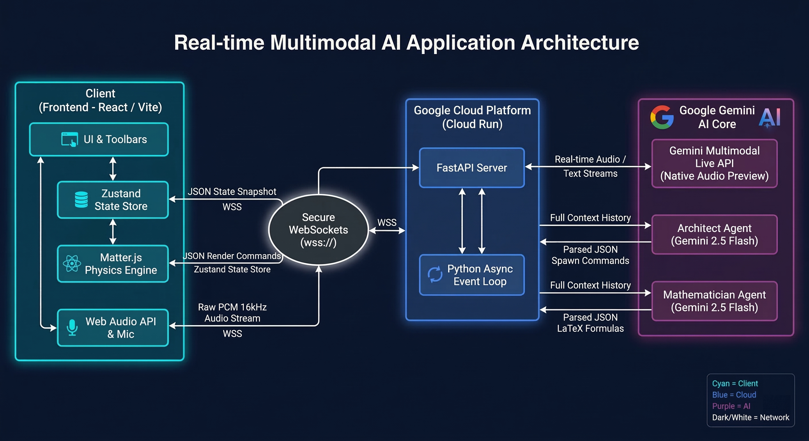

# DrawDynamics PRO ⚛️🎙️

> A voice-controlled AI physics laboratory that listens, builds, predicts, and explains real-time simulations. Built for the **#GeminiLiveAgentChallenge**.

## 🚀 Overview
For university students and autodidacts, there is a frustrating gap in physics education. Flat textbook equations lack intuitive visual feedback, and traditional physics sandboxes require tedious manual clicking and dragging. 

**DrawDynamics PRO** bridges this gap. It is an interactive, real-time physics laboratory where students can simply *talk* to a multi-agent AI tutor, ask for an experiment, and watch the math come to life on the screen.

## ✨ Key Features
* **🗣️ Agentic Object Spawning:** Speak into your microphone to command the AI to instantly build scenarios (e.g., "Spawn a heavy box colliding with a small ball") on the canvas. 
* **🔮 The Predictive Oracle:** By analyzing a hidden JSON snapshot of the canvas, the AI can predict the outcome of complex collisions or kinematic events *before* the engine is unpaused.
* **🚨 Proactive System Alerts:** A background observer constantly monitors the `Matter.js` engine. If a massive kinetic event occurs (like a high-speed collision), it injects an alert into the Live API session, prompting the AI to interrupt and explain the physics unprompted.
* **📐 Real-Time Math Log:** As the AI explains concepts, a background agent extracts the relevant formulas and renders them dynamically in a LaTeX-powered UI.

## 🧠 System Architecture
Our architecture separates the high-speed physics simulation from the AI orchestration to ensure the frontend never blocks or drops frames.

The system utilizes a tri-agent architecture running over a single continuous WebSocket:
1. **The Live Voice (Gemini Multimodal Live API):** Handles low-latency audio streaming for a natural, interruptible conversation.
2. **The Architect (Gemini 2.5 Flash):** Eavesdrops on the context and outputs strict JSON to seamlessly manipulate the `Matter.js` engine.
3. **The Mathematician (Gemini 2.5 Flash):** Listens to the tutor's explanations, extracts core physics formulas, and pushes them to the frontend's KaTeX renderer.

## 🛠️ Tech Stack
* **Frontend:** React, Vite, Tailwind CSS, Matter.js (Physics), Zustand (State), KaTeX (Math)
* **Backend:** Python, FastAPI, Uvicorn, WebSockets
* **AI Core:** Google Gemini Multimodal Live API, Gemini 2.5 Flash
* **Cloud Infrastructure:** Docker, Google Cloud Run (Backend), Vercel (Frontend)

---

## 🧪 Reproducible Testing Instructions

To verify the functionality of **DrawDynamics PRO**, follow the steps below. We highly recommend using the live hosted version for the smoothest experience, as the cloud backend is already configured with the necessary API keys and WebSockets.

### Option 1: Live Demo (Recommended)
1. Navigate to the live frontend: **[INSERT YOUR VERCEL URL HERE]**
2. *Note: Please ensure you are using a modern browser (Chrome/Edge) and allow Microphone permissions when prompted.*

### Option 2: Running Locally from Source
If you prefer to run the code locally:
1. Clone this repository: `git clone https://github.com/nimeshkavindu/DrawDynamics.git`
2. **Start the Backend:**
   * Navigate to the `/backend` folder.
   * Create a virtual environment and install dependencies: `pip install -r requirements.txt`
   * Export your Gemini API key: `export GEMINI_API_KEY="your_api_key_here"`
   * Run the FastAPI server: `uvicorn server:app --reload --port 8000`
3. **Start the Frontend:**
   * Open a new terminal and navigate to the `/frontend` folder.
   * Run `npm install` followed by `npm run dev`.
   * Open `http://localhost:5173` in your browser. *(Note: Ensure `App.jsx` points to `ws://localhost:8000/ws` if testing strictly locally).*

---

### 🎯 The Testing Walkthrough (What to try)
Once the app is open, follow this quick script to test the multimodal agents and physics engine:

**Test 1: Voice-Activated Spawning & Math Log**
* Click the **Microphone** button to activate the Gemini Live API.
* Speak clearly: *"I want to demonstrate simple harmonic motion. Please spawn a pendulum and show me the formula for its period."*
* **Expected Result:** The AI will speak a response, spawn the pendulum, and the KaTeX `Math Log` tab on the right will update with the exact formula.

**Test 2: The Predictive Oracle**
* Pause the engine (bottom left corner).
* Click the **Batting Cage** preset on the left sidebar. 
* Open the **Inspector** tab and click on the objects to verify their masses.
* Click the purple **Analyze Simulation** button on the bottom left.
* **Expected Result:** The AI reads the hidden JSON canvas state and predicts the collision outcome *before* you even unpause the engine.

**Test 3: Proactive System Alerts**
* Following Test 2, click **Run Simulation**.
* **Expected Result:** The motor blade will violently strike the ball. This triggers our background script's `10000` impact force threshold, injecting a system alert into the Live API. The AI will proactively interrupt and explain the massive kinetic transfer unprompted!

**Test 4: Live Environment Editing**
* Pause the simulation and clear the board. Drop a single box.
* Use the sliders on the left to change **Gravity** to `1.62` (Moon gravity).
* Select the box and use the **Inspector** to change its `Velocity (x)` to `50`. 
* Unpause the engine.
* **Expected Result:** The box will float smoothly in lunar gravity, proving the real-time UI manipulation flawlessly overrides the Matter.js engine.
